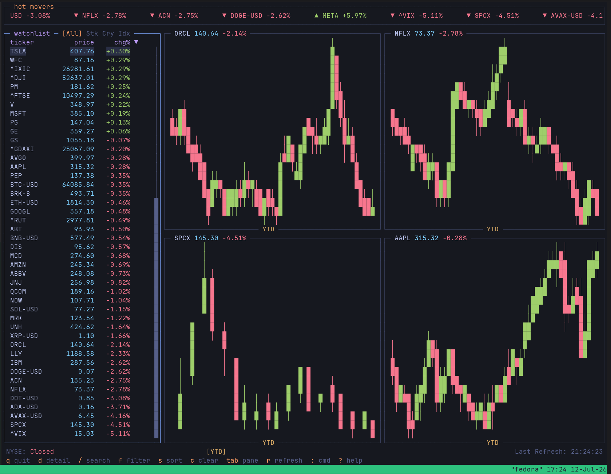
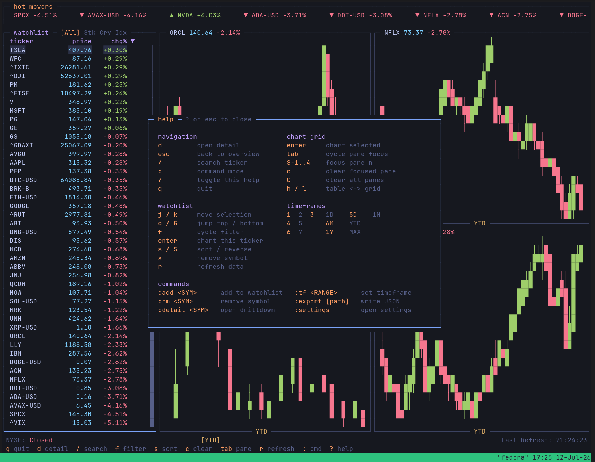
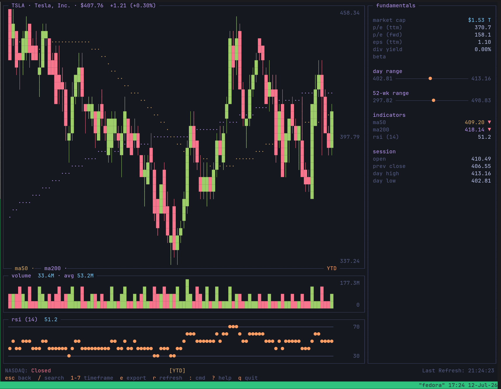
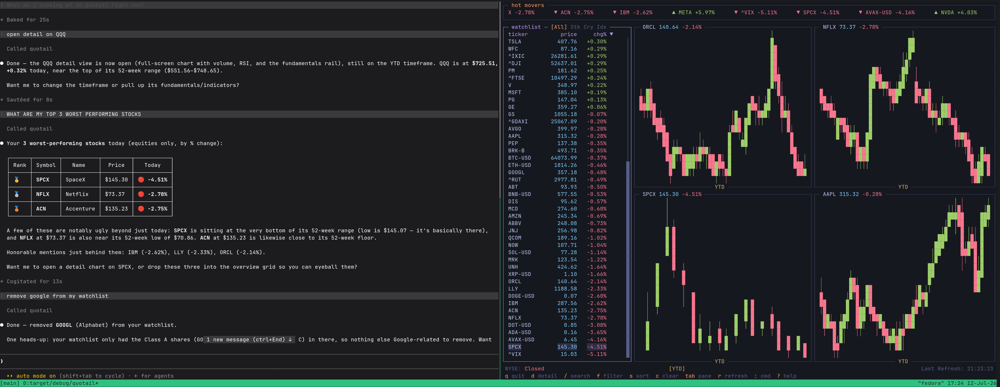

# Quotail

**A terminal stock-market dashboard with live data — and an MCP server that lets
Claude read your watchlist and drive the TUI.**



Quotail is a fast, keyboard-driven TUI for watching stocks, crypto, and indices.
It pulls live data from Yahoo Finance, lays out a tmux-style grid of charts, and
drills down into any symbol with RSI, moving averages, volume, and fundamentals.
It also exposes everything it knows over MCP, so an AI client like Claude can query
your watchlist and control the terminal for you.

---

## Install

```sh
cargo install quotail
quotail
```

On first launch, Quotail writes a default config to
`~/.config/quotail/config.toml` and starts polling quotes. No API key or account is
required.

## Building from source

```sh
git clone https://github.com/vivvyk/quotail
cd quotail
cargo install --path .
```

## Requirements

- **Rust 1.85+** (edition 2024) — to `cargo install` or build from source.
- **Linux or macOS** — MCP session control uses a Unix domain socket.
- **Network access** to Yahoo Finance.

---

## Features

- **Watchlist** of stocks, crypto, and indices — filterable (all / stocks / crypto
  / indices), sortable (symbol, price, % change, market cap), and scrollable.
- **2×2 chart grid**, tmux-style — up to four symbols on screen at once, with pane
  focus and per-pane clearing.
- **Detail drilldown** — a full-screen view with a large price chart, **RSI(14)**,
  **MA50 / MA200** overlays, a volume panel, and a fundamentals rail (market cap,
  P/E, EPS, dividend yield, beta).
- **7 timeframes** — `1D`, `5D`, `1M`, `6M`, `YTD`, `1Y`, `MAX`.
- **Vim-modal keybinds** — `hjkl` navigation, `/` search, and a `:` command line.
- **Scrolling hot-movers tape** across the top.
- **Themeable** — `tokyonight`, `gruvbox`, `catppuccin`, `nord`.
- **MCP server** built in — connect Claude and let it read *and* drive Quotail.

---

## Usage

Launch with `quotail`. Press `?` for the in-app help overlay:



The detail view (`d`) shows a large chart with RSI, moving averages, volume, and a
fundamentals rail:



### Keymap

| Navigation        |                          | Chart grid          |                        |
|-------------------|--------------------------|---------------------|------------------------|
| `d`               | open detail              | `enter`             | chart selected symbol  |
| `esc`             | back to overview         | `tab`               | cycle pane focus       |
| `/`               | search ticker            | `Shift`+`1`..`4`    | focus pane *n*         |
| `:`               | command mode             | `c`                 | clear focused pane     |
| `?`               | toggle help              | `C`                 | clear all panes        |
| `q`               | quit                     | `h` / `l`           | move table ↔ grid      |

| Watchlist         |                          | Timeframes          |                        |
|-------------------|--------------------------|---------------------|------------------------|
| `j` / `k`         | move selection           | `1` `2` `3`         | 1D · 5D · 1M           |
| `g` / `G`         | jump top / bottom        | `4` `5`             | 6M · YTD               |
| `f`               | cycle filter             | `6` `7`             | 1Y · MAX               |
| `enter`           | chart this ticker        |                     |                        |
| `s` / `S`         | sort / reverse           |                     |                        |
| `x`               | remove symbol            |                     |                        |
| `r`               | refresh data             |                     |                        |

### Commands

| Command            | Effect                       |
|--------------------|------------------------------|
| `:add <SYM>`       | add a symbol to the watchlist |
| `:rm <SYM>`        | remove a symbol               |
| `:detail <SYM>`    | open the drilldown            |
| `:tf <RANGE>`      | set the timeframe (`1D`..`MAX`) |
| `:export [path]`   | write the current data to JSON |
| `:settings`        | open settings                 |

Symbols use Yahoo convention: `AAPL` for stocks, `BTC-USD` for crypto, `^GSPC` for
indices.

---

## MCP

Quotail ships an **MCP server**. Point an MCP client such as Claude Code or Claude
Desktop at it and Claude can **read your watchlist** *and* **drive the running
TUI** — add symbols, open charts, change the timeframe, and see what's on screen.



**Worked example.** You type into Claude:

> *"Chart the three worst performers in my watchlist."*

Claude calls `get_watchlist_quotes`, ranks your symbols by percent change, then
calls `chart_symbol` three times — and the charts appear in your terminal.

### Tool Tiers

- **READ tools** (`get_watchlist_quotes`, `get_candles`, `get_indicators`, …) read
  from Yahoo and your config, so they work **with or without** the TUI running.
- **CONTROL / SESSION tools** (`add_symbol`, `chart_symbol`, `set_timeframe`,
  `get_session`, …) drive a **running TUI** over a local Unix socket.

### Setup

Install a real binary, then register the server.

```sh
cargo install --path .          # so there's a `quotail` on your PATH
claude mcp add quotail -- quotail --mcp
```

Or add it to your client's MCP config manually:

```json
{
  "mcpServers": {
    "quotail": {
      "command": "quotail",
      "args": ["--mcp"]
    }
  }
}
```

See [docs/MCP.md](docs/MCP.md) for the full reference: every tool, its arguments and
return shape, the socket's security model, and more example prompts.

---

## Configuration

Config lives at `~/.config/quotail/config.toml`, generated from a bundled template
on first run and **never clobbered** afterward — it's yours to hand-edit. It holds:

- **`[watchlist]`** — your `stocks`, `crypto`, and `indices` lists.
- **`[display]`** — `theme`, `default_timeframe`, `default_filter`, `default_sort`,
  and the hot-movers tape (`ticker_scroll`, `ticker_speed_ms`).
- **`[data]`** — `provider`, `poll_interval_sec` (default 60), `cache_ttl_sec`.
- **`[mcp]`** — `enabled` and `socket_path`.

Ephemeral UI state (which charts you had open, pane focus, etc.) is **not** stored
in the config. It lives in `~/.local/state/quotail/session.json` and is safe to
delete at any time.

---

## License

Licensed under either of

- Apache License, Version 2.0 ([LICENSE-APACHE](LICENSE-APACHE))
- MIT license ([LICENSE-MIT](LICENSE-MIT))
